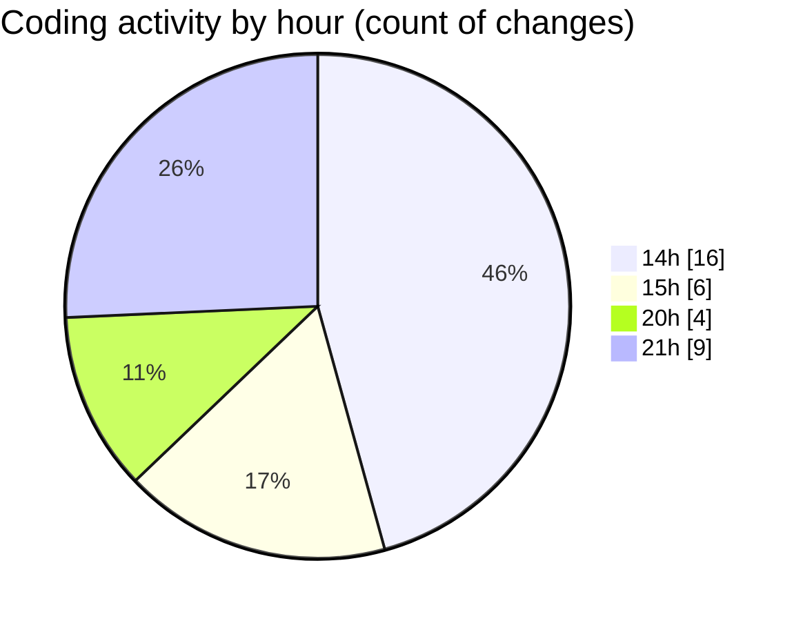

# video-downloader - Activity Summary 

## Overall Statistics

| Stat                   | Value                                                             |
| ---------------------- | ----------------------------------------------------------------- |
| **Lines Added** (➕)   | 530                                          |
| **Lines Removed** (➖) | 203                                        |
| **Net Change** (↕)    | 327                |
| **Active Time** (⌚)   | 44 minutes |

## Modified Files
- **telegram_handler.py** (+67, -0)
- **stream_handler.py** (+307, -194)
- **Dockerfile** (+28, -4)
- **requirements.txt** (+8, -0)
- **main.py** (+101, -3)
- **docker-compose.yaml** (+19, -2)

## Visualizations

### By File Type (Lines Changed)

### By Hour (Estimated Activity Count)

> **Last Updated:** 18/09/2026, 21:35:27