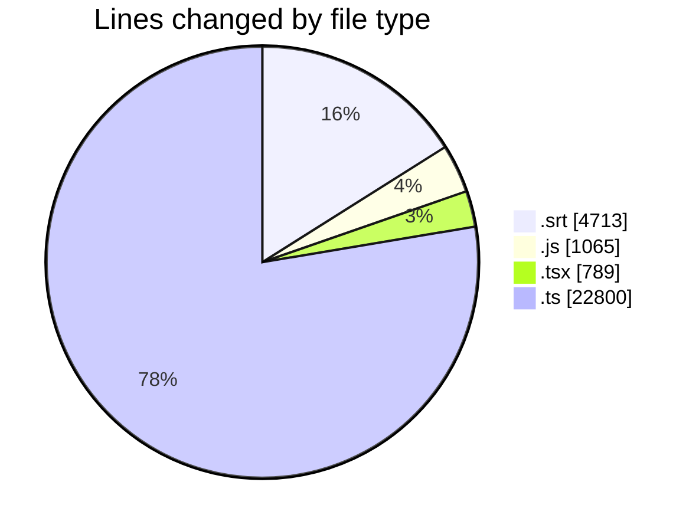
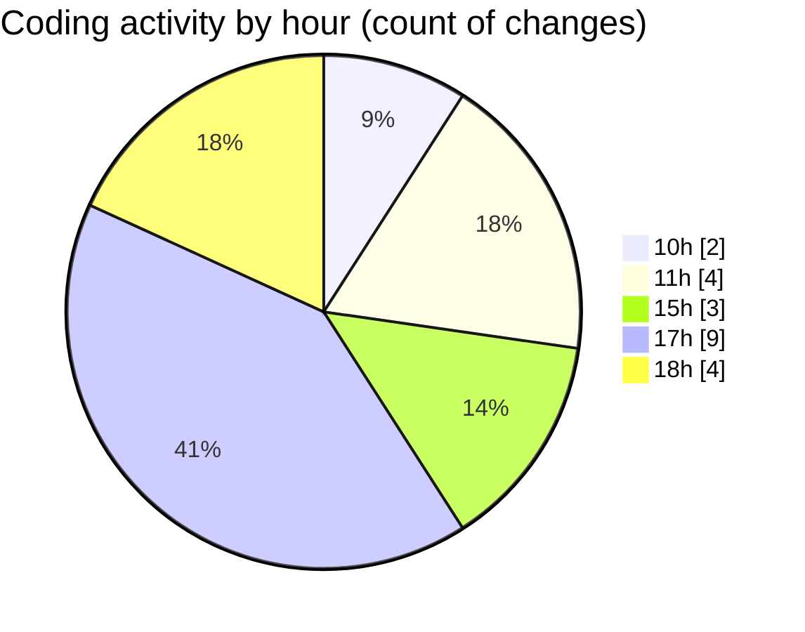

# cda - Activity Summary 

## Overall Statistics

| Stat                   | Value                                                             |
| ---------------------- | ----------------------------------------------------------------- |
| **Lines Added** (➕)   | 28910                                          |
| **Lines Removed** (➖) | 457                                        |
| **Net Change** (↕)    | 28453                |
| **Active Time** (⌚)   | 17 minutes |

## Modified Files
- **American Hostage (2026) - S01E01.fa.srt** (+4257, -456)
- **skills.js** (+1, -0)
- **SkillCreate.tsx** (+18, -0)
- **transform-skill-favourites.test.ts** (+11, -0)
- **PendingSkillTopic.tsx** (+1, -0)
- **yesalert.ts** (+889, -0)
- **vite.config.ts** (+78, -0)
- **GroupService.ts** (+916, -0)
- **yesalert.js** (+1064, -0)
- **MockPermissionsService.ts** (+197, -0)
- **PermissionService.ts** (+715, -0)
- **UserProvider.tsx** (+199, -1)
- **GroupService.test.ts** (+2105, -0)
- **resolvers-types.ts** (+17889, -0)
- **Alerts.test.tsx** (+570, -0)

## Visualizations

### By File Type (Lines Changed)

### By Hour (Estimated Activity Count)

> **Last Updated:** 21/09/2026, 18:46:20