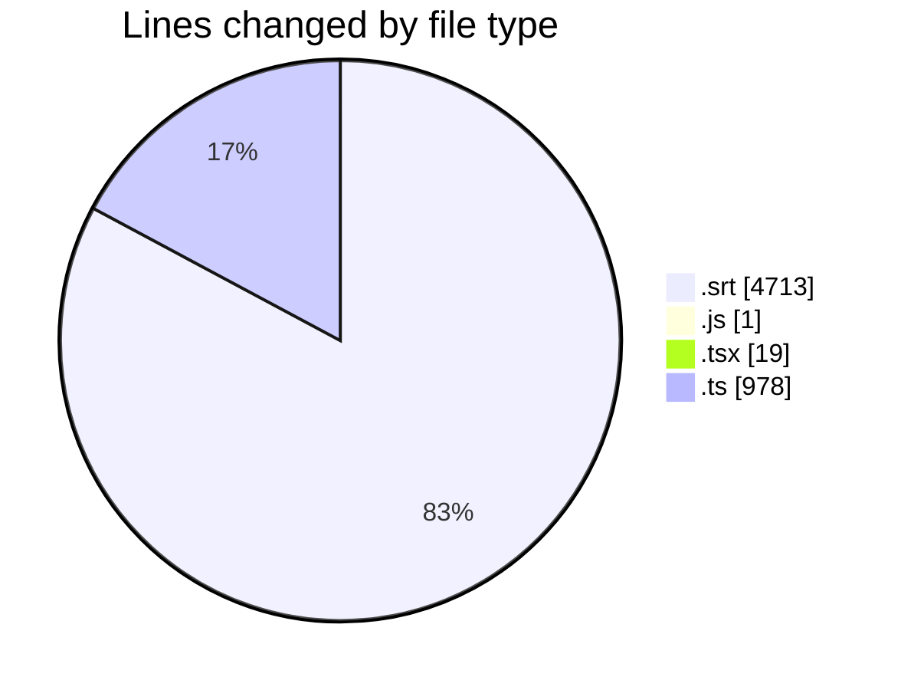
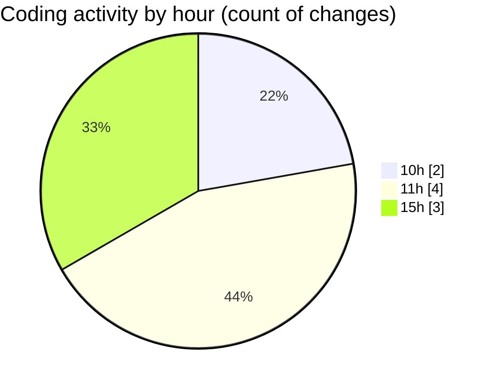

# cda - Activity Summary 

## Overall Statistics

| Stat                   | Value                                                             |
| ---------------------- | ----------------------------------------------------------------- |
| **Lines Added** (➕)   | 5255                                          |
| **Lines Removed** (➖) | 456                                        |
| **Net Change** (↕)    | 4799                |
| **Active Time** (⌚)   | 3 minutes |

## Modified Files
- **American Hostage (2026) - S01E01.fa.srt** (+4257, -456)
- **skills.js** (+1, -0)
- **SkillCreate.tsx** (+18, -0)
- **transform-skill-favourites.test.ts** (+11, -0)
- **PendingSkillTopic.tsx** (+1, -0)
- **yesalert.ts** (+889, -0)
- **vite.config.ts** (+78, -0)

## Visualizations

### By File Type (Lines Changed)

### By Hour (Estimated Activity Count)

> **Last Updated:** 21/09/2026, 15:56:20