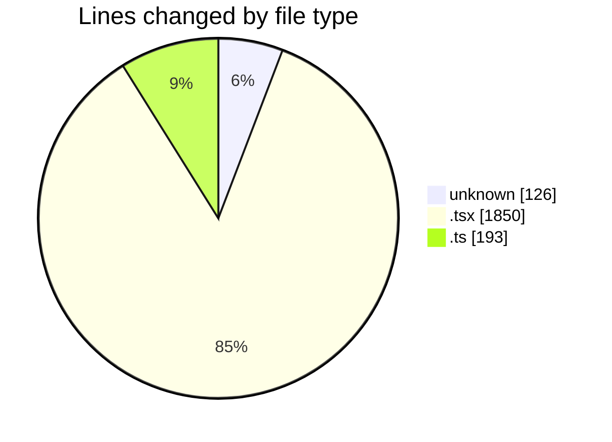
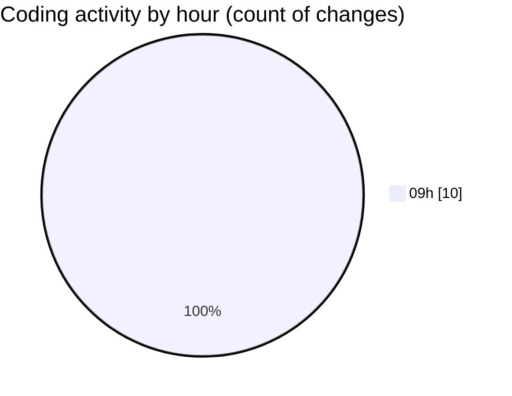

# cda - Activity Summary 

## Overall Statistics

| Stat                   | Value                                                             |
| ---------------------- | ----------------------------------------------------------------- |
| **Lines Added** (➕)   | 2128                                          |
| **Lines Removed** (➖) | 41                                        |
| **Net Change** (↕)    | 2087                |
| **Active Time** (⌚)   | 16 minutes |

## Modified Files
- **.env** (+126, -0)
- **NewGroupPanel.tsx** (+411, -0)
- **NewGroupPanel.test.tsx** (+580, -41)
- **NewGroup.tsx** (+638, -0)
- **GroupService.test.ts** (+1, -0)
- **MockGroupMemberService.ts** (+113, -0)
- **types.ts** (+79, -0)
- **PeopleViewComparison.tsx** (+180, -0)

## Visualizations

### By File Type (Lines Changed)

### By Hour (Estimated Activity Count)

> **Last Updated:** 23/09/2026, 09:26:21