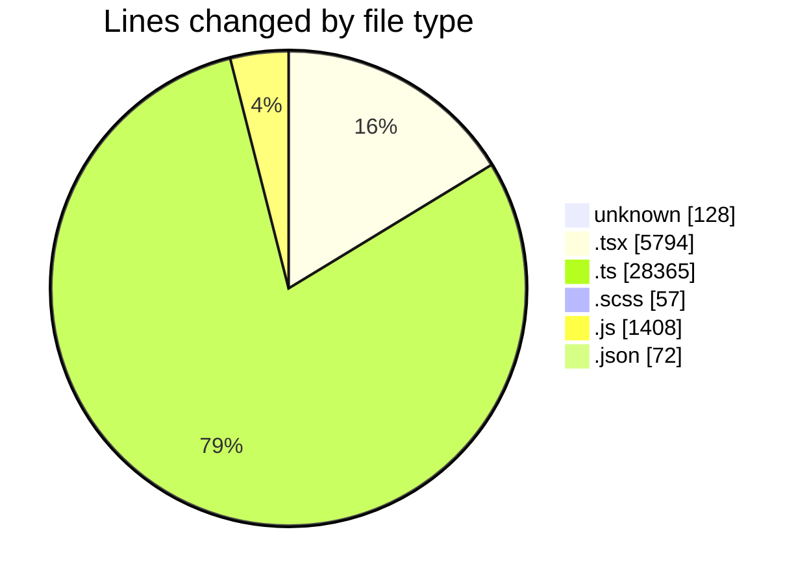
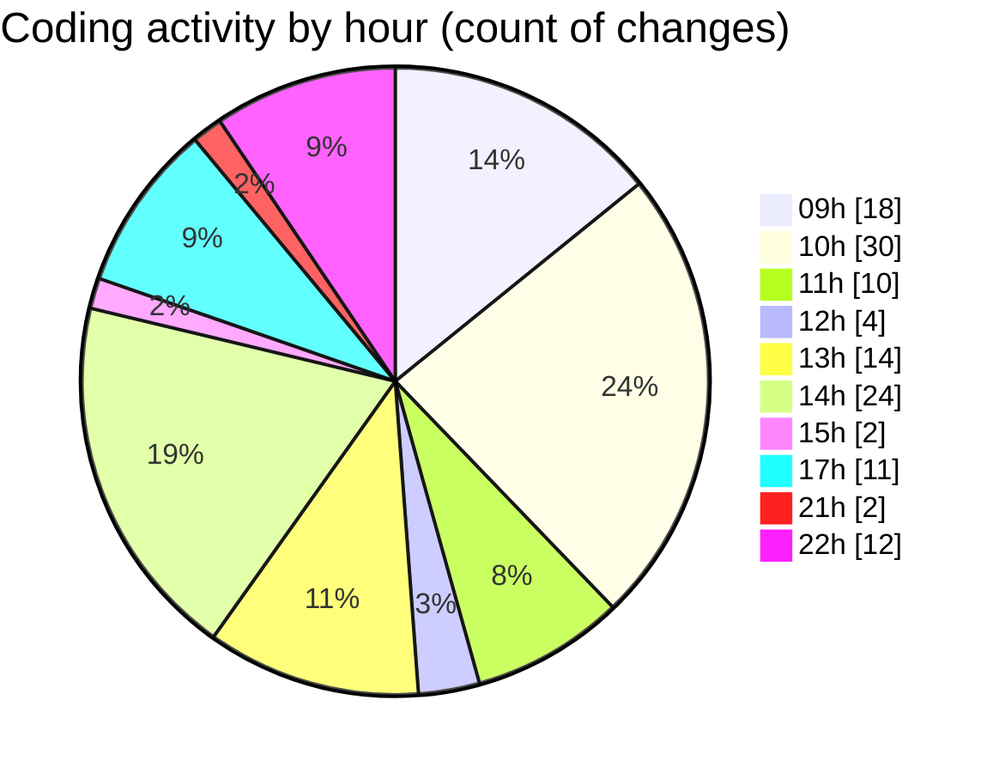

# cda - Activity Summary 

## Overall Statistics

| Stat                   | Value                                                             |
| ---------------------- | ----------------------------------------------------------------- |
| **Lines Added** (➕)   | 35365                                          |
| **Lines Removed** (➖) | 459                                        |
| **Net Change** (↕)    | 34906                |
| **Active Time** (⌚)   | 177 minutes |

## Modified Files
- **.env** (+126, -0)
- **NewGroupPanel.tsx** (+411, -0)
- **NewGroupPanel.test.tsx** (+580, -41)
- **NewGroup.tsx** (+675, -0)
- **GroupService.test.ts** (+2115, -36)
- **MockGroupMemberService.ts** (+113, -0)
- **types.ts** (+79, -0)
- **PeopleViewComparison.tsx** (+180, -0)
- **gql.ts** (+460, -0)
- **graphql.ts** (+7798, -2)
- **UserProvider.test.tsx** (+688, -61)
- **groups.ts** (+171, -0)
- **graphql.ts** (+10717, -0)
- **Group.tsx** (+249, -35)
- **Alerts.tsx** (+1083, -17)
- **Group.test.tsx** (+332, -19)
- **OwnershipMarker.tsx** (+26, -6)
- **OwnershipMarker.scss** (+32, -25)
- **index.ts** (+3, -0)
- **Alerts.test.tsx** (+569, -1)
- **PermissionService.test.ts** (+2499, -51)
- **yesalert.ts** (+978, -49)
- **RouteWrapper.test.tsx** (+268, -0)
- **RouteWrapper.tsx** (+219, -19)
- **UserProvider.tsx** (+5, -16)
- **App.tsx** (+294, -0)
- **GroupService.ts** (+908, -19)
- **20260923123744-create-yesalert-groups-view.js** (+92, -44)
- **sap_views.ts** (+1875, -2)
- **PermissionService.ts** (+77, -0)
- **MockPermissionsService.ts** (+10, -0)
- **tables.ts** (+50, -0)
- **views.ts** (+13, -12)
- **20260923123745-create-yesalert-groups-view.js** (+52, -4)
- **groupOwnership.ts** (+8, -0)
- **ReportingService.test.ts** (+320, -0)
- **HEAD** (+2, -0)
- **yesalert.js** (+1084, -0)
- **20260923123746-create-yesalert-groups-view.js** (+66, -0)
- **20260923123747-create-yesalert-groups-view.js** (+66, -0)
- **package.json** (+72, -0)

## Visualizations

### By File Type (Lines Changed)

### By Hour (Estimated Activity Count)

> **Last Updated:** 23/09/2026, 22:44:12