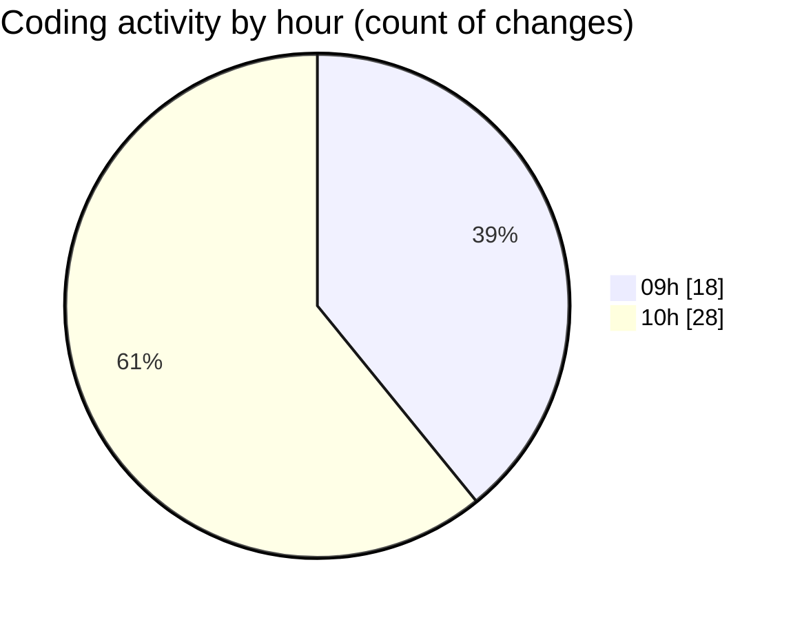

# cda - Activity Summary 

## Overall Statistics

| Stat                   | Value                                                             |
| ---------------------- | ----------------------------------------------------------------- |
| **Lines Added** (➕)   | 22791                                          |
| **Lines Removed** (➖) | 114                                        |
| **Net Change** (↕)    | 22677                |
| **Active Time** (⌚)   | 64 minutes |

## Modified Files
- **.env** (+126, -0)
- **NewGroupPanel.tsx** (+411, -0)
- **NewGroupPanel.test.tsx** (+580, -41)
- **NewGroup.tsx** (+638, -0)
- **GroupService.test.ts** (+1, -0)
- **MockGroupMemberService.ts** (+113, -0)
- **types.ts** (+79, -0)
- **PeopleViewComparison.tsx** (+180, -0)
- **gql.ts** (+460, -0)
- **graphql.ts** (+7798, -0)
- **UserProvider.test.tsx** (+330, -0)
- **groups.ts** (+171, -0)
- **graphql.ts** (+10717, -0)
- **Group.tsx** (+246, -27)
- **Alerts.tsx** (+549, -15)
- **Group.test.tsx** (+331, -0)
- **OwnershipMarker.tsx** (+26, -6)
- **OwnershipMarker.scss** (+32, -25)
- **index.ts** (+3, -0)

## Visualizations

### By File Type (Lines Changed)

### By Hour (Estimated Activity Count)

> **Last Updated:** 23/09/2026, 10:46:21