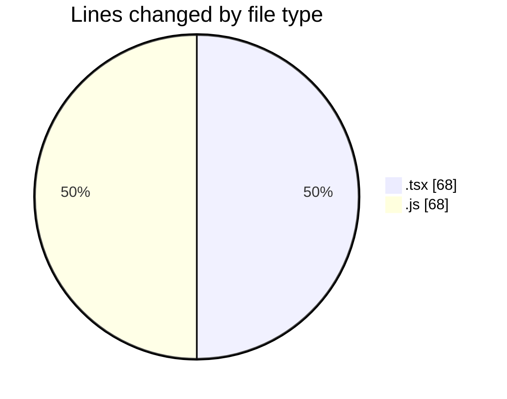
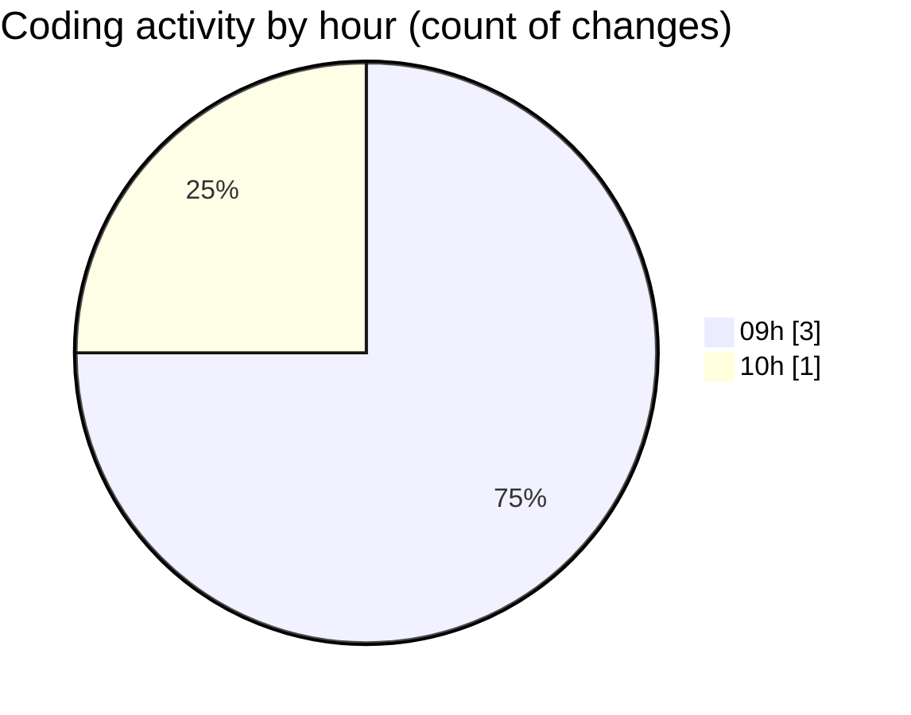

# cda - Activity Summary 

## Overall Statistics

| Stat                   | Value                                                             |
| ---------------------- | ----------------------------------------------------------------- |
| **Lines Added** (➕)   | 68                                          |
| **Lines Removed** (➖) | 68                                        |
| **Net Change** (↕)    | 0                |
| **Active Time** (⌚)   | 2 minutes |

## Modified Files
- **Alerts.tsx** (+0, -2)
- **UserProvider.test.tsx** (+0, -61)
- **Group.tsx** (+0, -5)
- **20260923123748-create-yesalert-groups-view.js** (+68, -0)

## Visualizations

### By File Type (Lines Changed)

### By Hour (Estimated Activity Count)

> **Last Updated:** 25/09/2026, 10:19:58