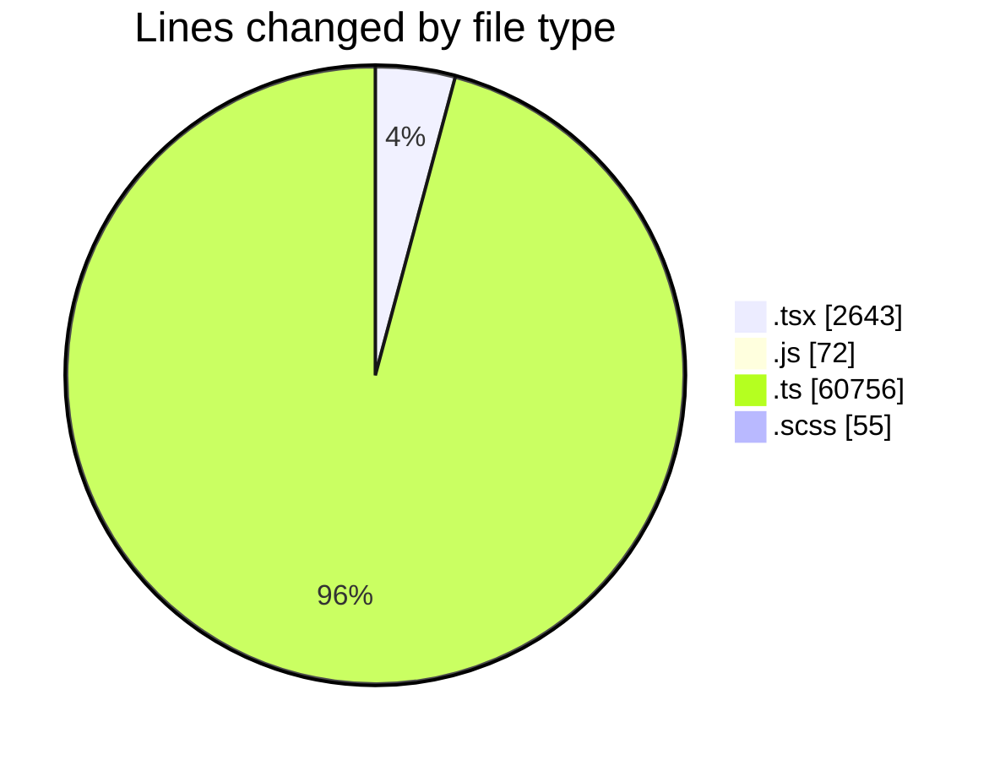
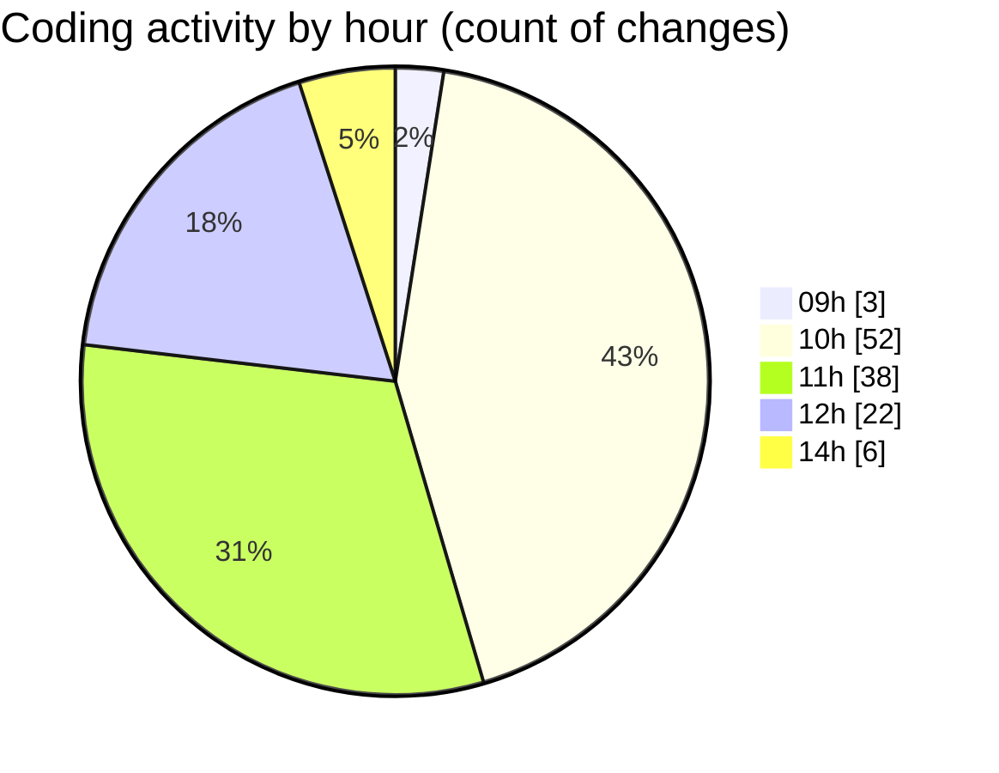

# cda - Activity Summary 

## Overall Statistics

| Stat                   | Value                                                             |
| ---------------------- | ----------------------------------------------------------------- |
| **Lines Added** (➕)   | 62526                                          |
| **Lines Removed** (➖) | 1000                                        |
| **Net Change** (↕)    | 61526                |
| **Active Time** (⌚)   | 136 minutes |

## Modified Files
- **Alerts.tsx** (+34, -34)
- **UserProvider.test.tsx** (+47, -108)
- **Group.tsx** (+64, -62)
- **20260923123748-create-yesalert-groups-view.js** (+68, -0)
- **graphql.ts** (+8170, -372)
- **RouteWrapper.tsx** (+218, -0)
- **RouteWrapper.test.tsx** (+232, -0)
- **Group.test.tsx** (+331, -0)
- **Alerts.test.tsx** (+15, -15)
- **PeopleViewComparison.tsx** (+180, -0)
- **gql.ts** (+478, -0)
- **NewAlert.test.tsx** (+506, -0)
- **GroupAdminsTable.test.tsx** (+291, -48)
- **GroupAdminsTable.tsx** (+216, -0)
- **GroupService.ts** (+30, -30)
- **yesalert.js** (+2, -2)
- **GroupService.test.ts** (+84, -84)
- **graphql.ts** (+10776, -7)
- **groups.ts** (+171, -1)
- **UserProvider.tsx** (+198, -11)
- **vite.config.ts** (+77, -0)
- **types.ts** (+77, -0)
- **yesalert.ts** (+98, -98)
- **group-queries.ts** (+643, -113)
- **resolvers-types.ts** (+17920, -0)
- **sap_views.ts** (+1874, -0)
- **ReportingService.test.ts** (+321, -0)
- **tables.ts** (+8091, -0)
- **views.ts** (+11241, -0)
- **OwnershipMarker.scss** (+8, -1)
- **OwnershipMarker.tsx** (+15, -0)
- **Group.scss** (+32, -14)
- **OwnershipMarker.test.tsx** (+18, -0)

## Visualizations

### By File Type (Lines Changed)

### By Hour (Estimated Activity Count)

> **Last Updated:** 25/09/2026, 14:34:58