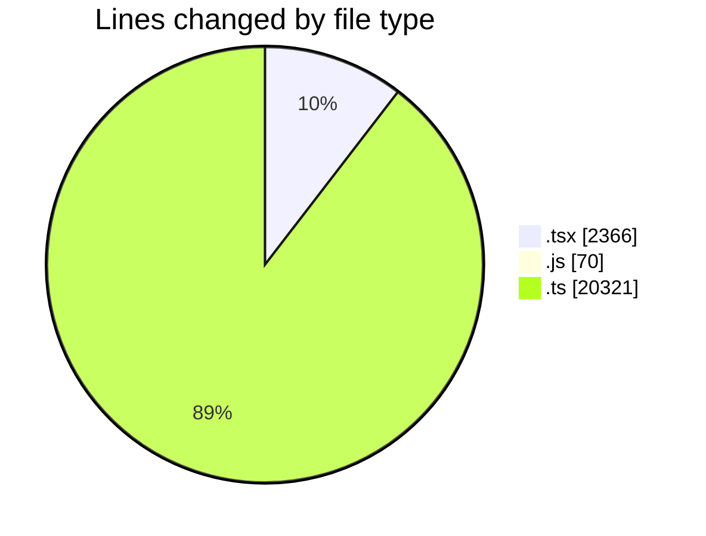

# cda - Activity Summary 

## Overall Statistics

| Stat                   | Value                                                             |
| ---------------------- | ----------------------------------------------------------------- |
| **Lines Added** (➕)   | 22267                                          |
| **Lines Removed** (➖) | 490                                        |
| **Net Change** (↕)    | 21777                |
| **Active Time** (⌚)   | 71 minutes |

## Modified Files
- **Alerts.tsx** (+14, -16)
- **UserProvider.test.tsx** (+47, -108)
- **Group.tsx** (+31, -36)
- **20260923123748-create-yesalert-groups-view.js** (+68, -0)
- **graphql.ts** (+7804, -189)
- **RouteWrapper.tsx** (+200, -0)
- **RouteWrapper.test.tsx** (+232, -0)
- **Group.test.tsx** (+313, -0)
- **Alerts.test.tsx** (+0, -15)
- **PeopleViewComparison.tsx** (+180, -0)
- **gql.ts** (+478, -0)
- **NewAlert.test.tsx** (+506, -0)
- **GroupAdminsTable.test.tsx** (+243, -0)
- **GroupAdminsTable.tsx** (+216, -0)
- **GroupService.ts** (+15, -15)
- **yesalert.js** (+1, -1)
- **GroupService.test.ts** (+42, -42)
- **graphql.ts** (+10775, -7)
- **groups.ts** (+171, -1)
- **UserProvider.tsx** (+198, -11)
- **vite.config.ts** (+77, -0)
- **types.ts** (+77, -0)
- **yesalert.ts** (+49, -49)
- **group-queries.ts** (+530, -0)

## Visualizations

### By File Type (Lines Changed)

### By Hour (Estimated Activity Count)

> **Last Updated:** 25/09/2026, 10:54:58