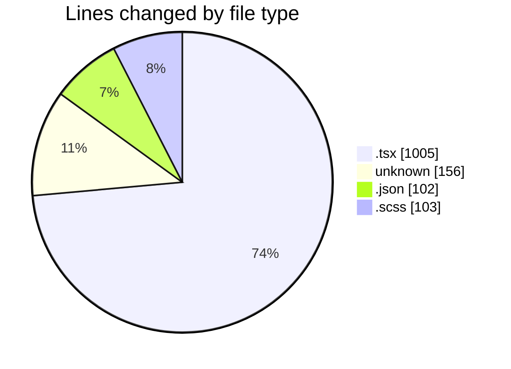
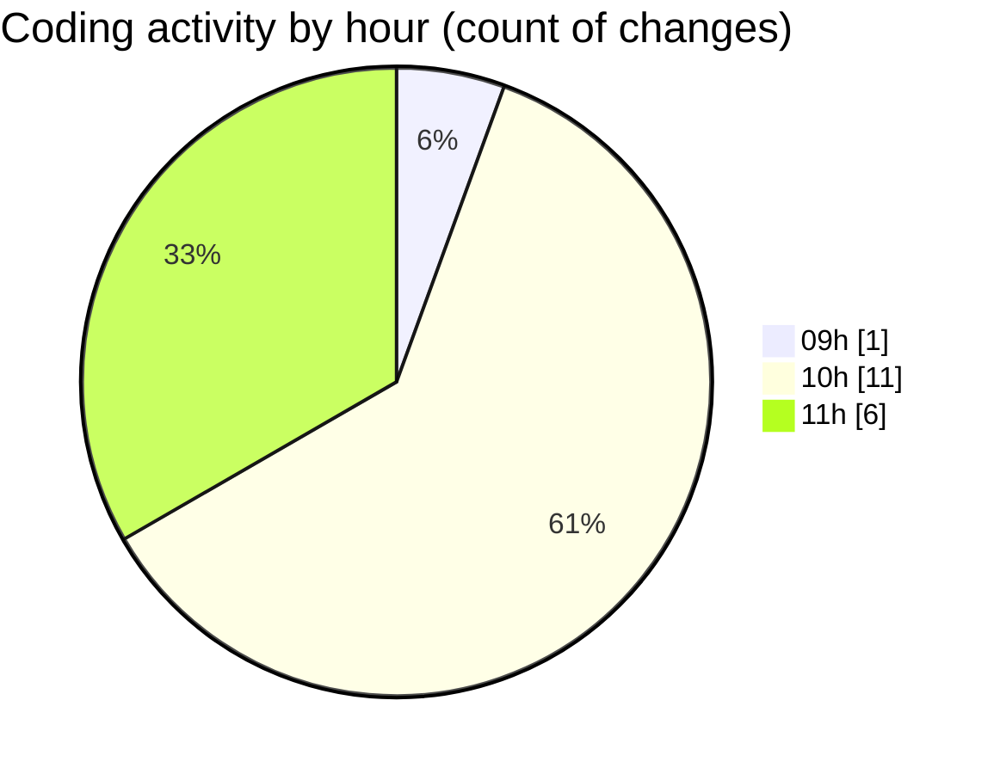

# cda - Activity Summary 

## Overall Statistics

| Stat                   | Value                                                             |
| ---------------------- | ----------------------------------------------------------------- |
| **Lines Added** (➕)   | 1356                                          |
| **Lines Removed** (➖) | 10                                        |
| **Net Change** (↕)    | 1346                |
| **Active Time** (⌚)   | 21 minutes |

## Modified Files
- **RouteWrapper.tsx** (+200, -0)
- **ignore** (+14, -4)
- **RouteWrapper.test.tsx** (+267, -0)
- **settings.json** (+97, -5)
- **Alerts.tsx** (+537, -1)
- **Alerts.scss** (+103, -0)
- **.env** (+138, -0)

## Visualizations

### By File Type (Lines Changed)

### By Hour (Estimated Activity Count)

> **Last Updated:** 28/09/2026, 11:59:46