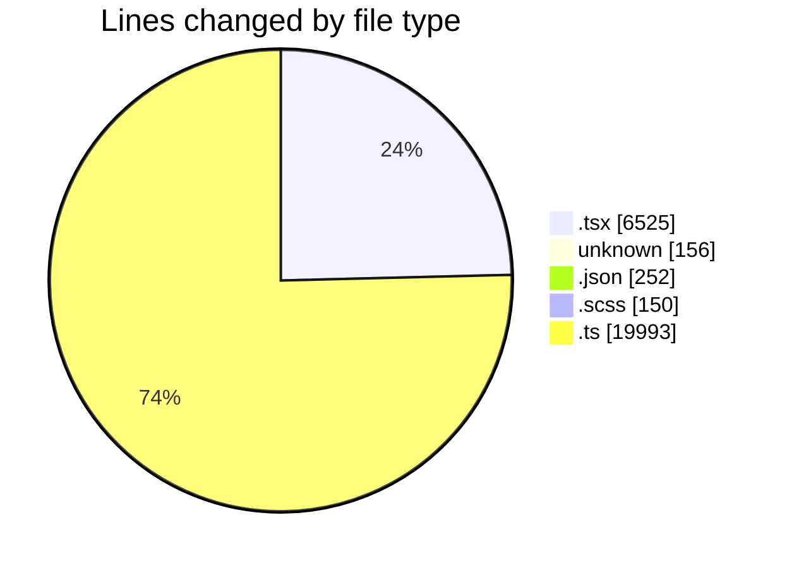
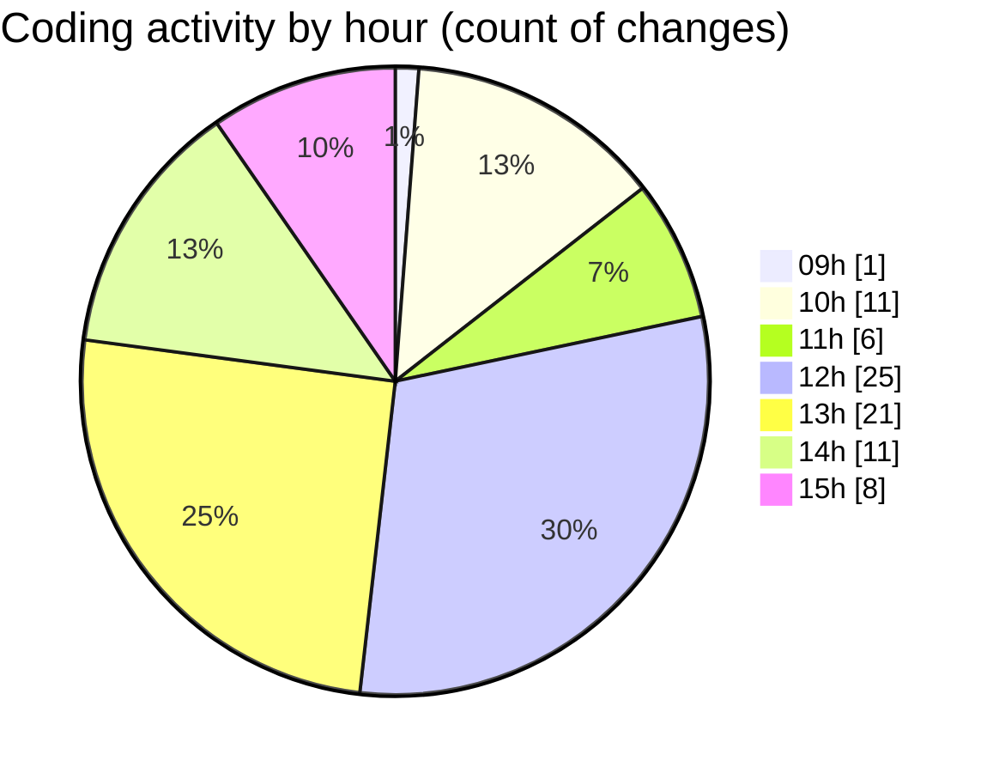

# cda - Activity Summary 

## Overall Statistics

| Stat                   | Value                                                             |
| ---------------------- | ----------------------------------------------------------------- |
| **Lines Added** (➕)   | 26703                                          |
| **Lines Removed** (➖) | 373                                        |
| **Net Change** (↕)    | 26330                |
| **Active Time** (⌚)   | 96 minutes |

## Modified Files
- **RouteWrapper.tsx** (+200, -0)
- **ignore** (+14, -4)
- **RouteWrapper.test.tsx** (+267, -35)
- **settings.json** (+97, -5)
- **Alerts.tsx** (+1075, -4)
- **Alerts.scss** (+115, -14)
- **.env** (+138, -0)
- **index.ts** (+4, -1)
- **package.json** (+72, -0)
- **CrownIcon.tsx** (+8, -0)
- **Group.tsx** (+219, -5)
- **Alerts.test.tsx** (+1159, -6)
- **AlertAccessMarker.test.tsx** (+31, -0)
- **AlertAccessMarker.scss** (+10, -0)
- **GroupAdminsTable.test.tsx** (+521, -278)
- **UserProvider.test.tsx** (+318, -0)
- **UserProvider.tsx** (+188, -0)
- **Group.test.tsx** (+323, -10)
- **groups.ts** (+170, -0)
- **graphql.ts** (+7615, -0)
- **graphql.ts** (+10769, -0)
- **NewAlert.test.tsx** (+508, -2)
- **APICheckerAddresses.tsx** (+63, -0)
- **DeduplicatedSiteRequestsTable.tsx** (+164, -2)
- **group-queries.ts** (+530, -0)
- **GroupService.ts** (+903, -1)
- **DeduplicatedSiteRequestsTable.scss** (+11, -0)
- **FaultsTable.tsx** (+273, -6)
- **package.json** (+78, -0)
- **SiteRecentIncidents.tsx** (+264, -0)
- **Incidents.tsx** (+596, -0)

## Visualizations

### By File Type (Lines Changed)

### By Hour (Estimated Activity Count)

> **Last Updated:** 28/09/2026, 15:52:26