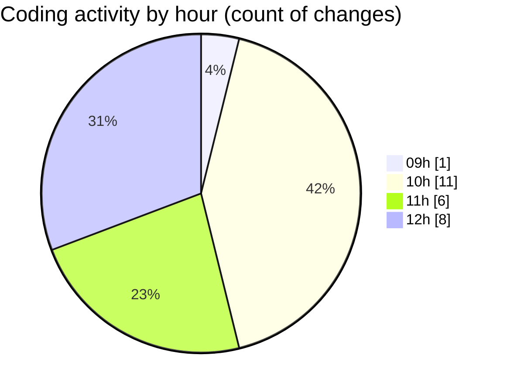

# cda - Activity Summary 

## Overall Statistics

| Stat                   | Value                                                             |
| ---------------------- | ----------------------------------------------------------------- |
| **Lines Added** (➕)   | 1432                                          |
| **Lines Removed** (➖) | 55                                        |
| **Net Change** (↕)    | 1377                |
| **Active Time** (⌚)   | 29 minutes |

## Modified Files
- **RouteWrapper.tsx** (+200, -0)
- **ignore** (+14, -4)
- **RouteWrapper.test.tsx** (+267, -35)
- **settings.json** (+97, -5)
- **Alerts.tsx** (+537, -4)
- **Alerts.scss** (+103, -6)
- **.env** (+138, -0)
- **index.ts** (+4, -1)
- **package.json** (+72, -0)

## Visualizations

### By File Type (Lines Changed)

### By Hour (Estimated Activity Count)

> **Last Updated:** 28/09/2026, 12:14:46