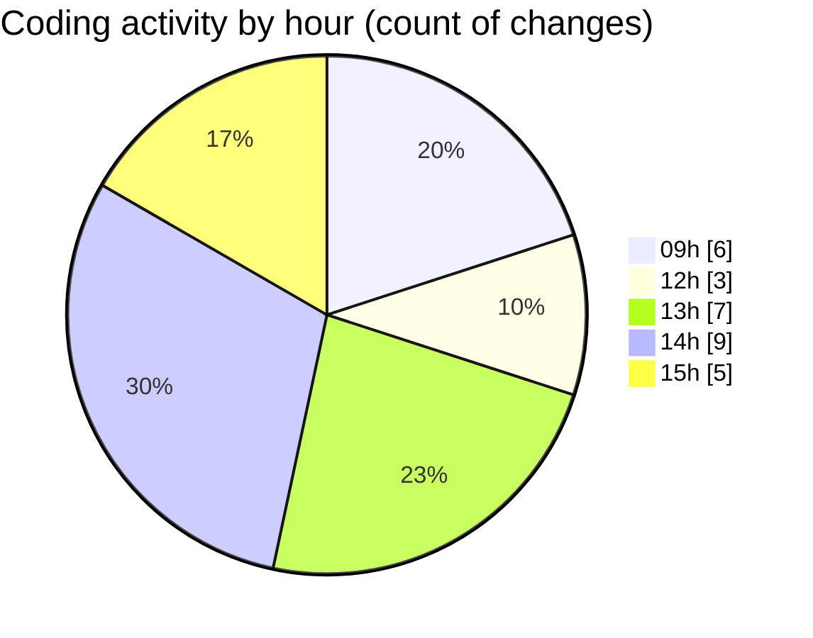

# cda - Activity Summary 

## Overall Statistics

| Stat                   | Value                                                             |
| ---------------------- | ----------------------------------------------------------------- |
| **Lines Added** (➕)   | 3050                                          |
| **Lines Removed** (➖) | 74                                        |
| **Net Change** (↕)    | 2976                |
| **Active Time** (⌚)   | 30 minutes |

## Modified Files
- **FaultsTable.tsx** (+272, -10)
- **FaultsTable.test.tsx** (+0, -16)
- **package.json** (+78, -0)
- **Home.scss** (+16, -5)
- **Services.test.tsx** (+340, -0)
- **ServicesListTable.tsx** (+173, -0)
- **SiteServices.test.tsx** (+128, -0)
- **HistoricPlannedWorkTable.tsx** (+175, -0)
- **RecentPlannedWorkTable.tsx** (+426, -0)
- **RequestsTable.tsx** (+243, -5)
- **DeduplicatedSiteRequestsTable.tsx** (+164, -1)
- **AggregatedRequestsTable.tsx** (+170, -0)
- **CrawlersTable.tsx** (+184, -0)
- **Home.test.tsx** (+332, -36)
- **Repeats.tsx** (+349, -1)

## Visualizations

### By File Type (Lines Changed)

### By Hour (Estimated Activity Count)

> **Last Updated:** 29/09/2026, 15:23:32