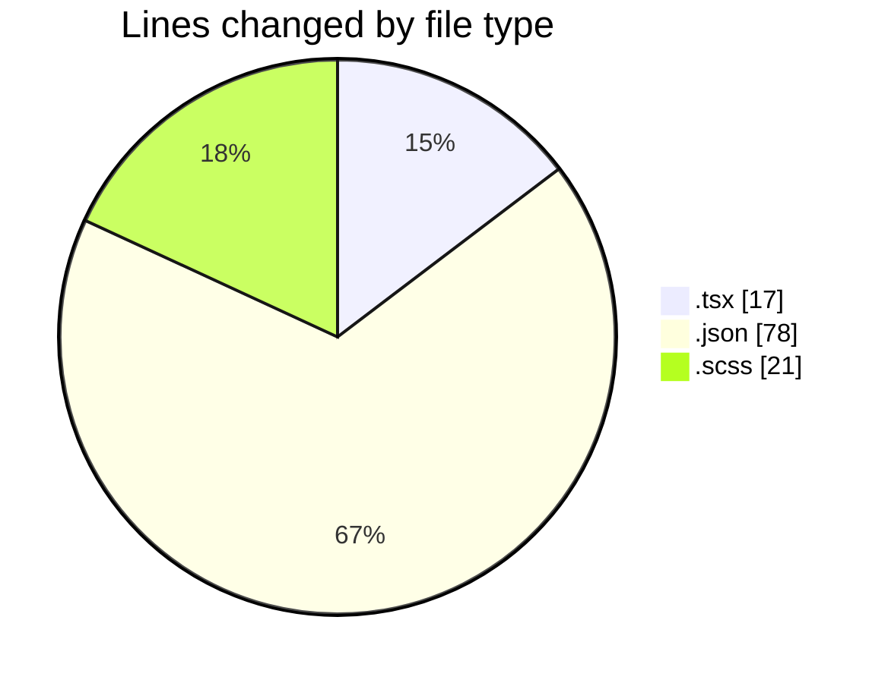
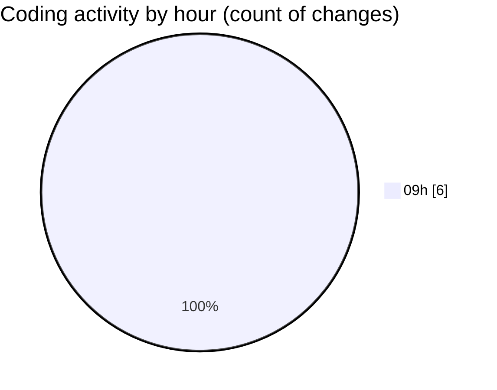

# cda - Activity Summary 

## Overall Statistics

| Stat                   | Value                                                             |
| ---------------------- | ----------------------------------------------------------------- |
| **Lines Added** (➕)   | 94                                          |
| **Lines Removed** (➖) | 22                                        |
| **Net Change** (↕)    | 72                |
| **Active Time** (⌚)   | 8 minutes |

## Modified Files
- **FaultsTable.tsx** (+0, -1)
- **FaultsTable.test.tsx** (+0, -16)
- **package.json** (+78, -0)
- **Home.scss** (+16, -5)

## Visualizations

### By File Type (Lines Changed)

### By Hour (Estimated Activity Count)

> **Last Updated:** 29/09/2026, 09:48:31