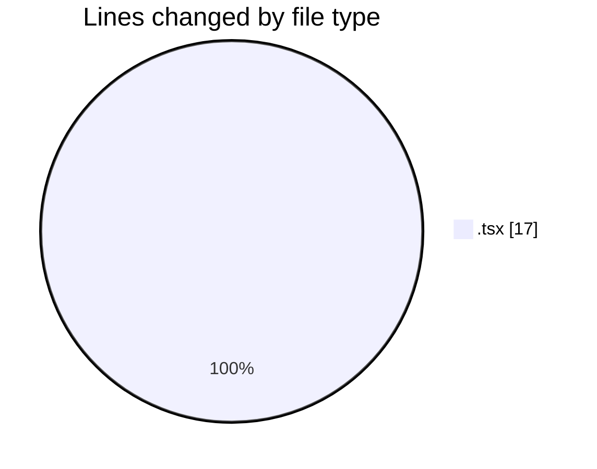

# cda - Activity Summary 

## Overall Statistics

| Stat                   | Value                                                             |
| ---------------------- | ----------------------------------------------------------------- |
| **Lines Added** (➕)   | 0                                          |
| **Lines Removed** (➖) | 17                                        |
| **Net Change** (↕)    | -17                |
| **Active Time** (⌚)   | 0 minute |

## Modified Files
- **FaultsTable.tsx** (+0, -1)
- **FaultsTable.test.tsx** (+0, -16)

## Visualizations

### By File Type (Lines Changed)

### By Hour (Estimated Activity Count)

> **Last Updated:** 29/09/2026, 09:38:25