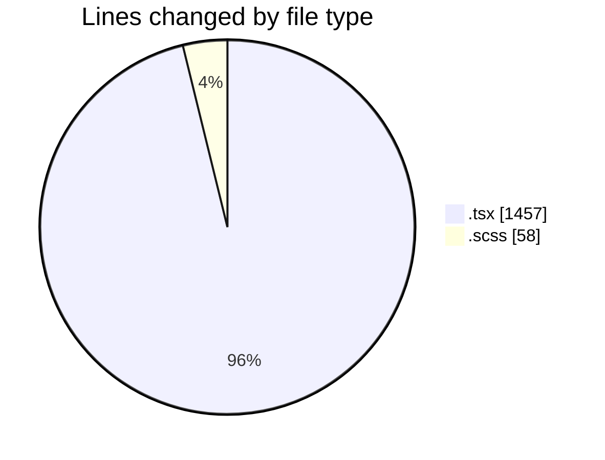
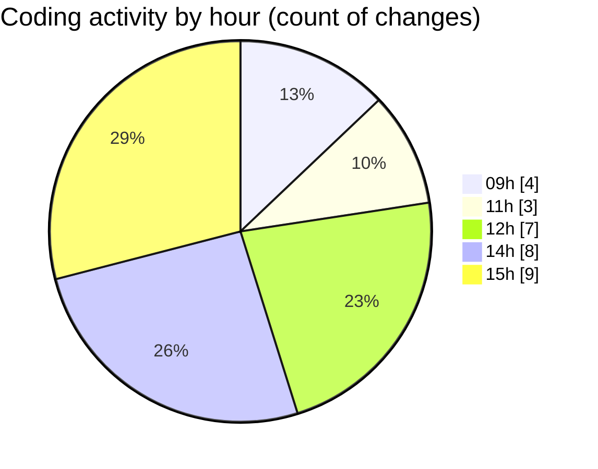

# cda - Activity Summary 

## Overall Statistics

| Stat                   | Value                                                             |
| ---------------------- | ----------------------------------------------------------------- |
| **Lines Added** (➕)   | 1400                                          |
| **Lines Removed** (➖) | 115                                        |
| **Net Change** (↕)    | 1285                |
| **Active Time** (⌚)   | 29 minutes |

## Modified Files
- **Group.tsx** (+236, -0)
- **Group.scss** (+58, -0)
- **UserProvider.tsx** (+72, -18)
- **AdminRoute.test.tsx** (+50, -0)
- **App.tsx** (+380, -42)
- **AppAccess.test.tsx** (+101, -0)
- **UserProvider.test.tsx** (+165, -37)
- **FaultsTable.tsx** (+299, -18)
- **AppAccess.tsx** (+39, -0)

## Visualizations

### By File Type (Lines Changed)

### By Hour (Estimated Activity Count)

> **Last Updated:** 05/10/2026, 15:09:23