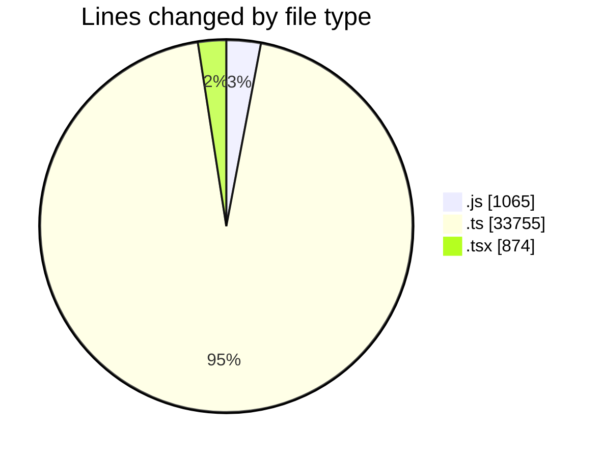
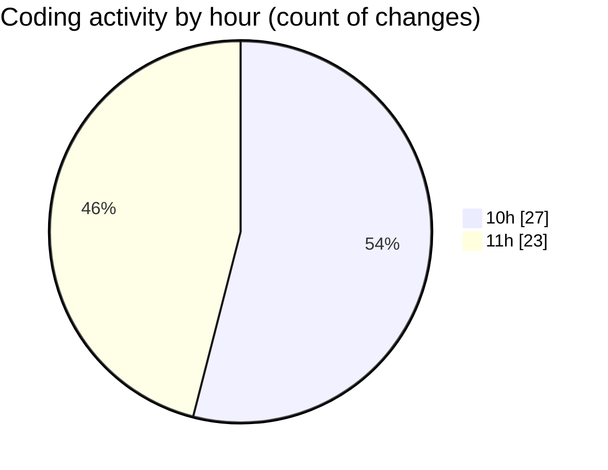

# cda - Activity Summary 

## Overall Statistics

| Stat                   | Value                                                             |
| ---------------------- | ----------------------------------------------------------------- |
| **Lines Added** (➕)   | 35541                                          |
| **Lines Removed** (➖) | 153                                        |
| **Net Change** (↕)    | 35388                |
| **Active Time** (⌚)   | 55 minutes |

## Modified Files
- **queries.js** (+537, -0)
- **index.ts** (+3, -0)
- **GenerateSkillTemplateTab.tsx** (+109, -0)
- **parseSkillWorkbook.test.ts** (+50, -3)
- **SkillImportPanel.test.tsx** (+45, -1)
- **SkillImportPanel.tsx** (+293, -69)
- **downloadSkillTemplate.ts** (+16, -0)
- **parseSkillWorkbook.ts** (+191, -0)
- **SkillAdmin.tsx** (+72, -8)
- **SkillCreate.test.tsx** (+235, -0)
- **graphql.ts** (+10088, -0)
- **gql.ts** (+340, -0)
- **graphql.ts** (+8268, -0)
- **skill-queries.ts** (+811, -34)
- **skills.js** (+514, -14)
- **SkillTemplateService.ts** (+172, -0)
- **resolvers-types.ts** (+13602, -0)
- **skill-template-queries.test.ts** (+85, -0)
- **SkillTemplateService.test.ts** (+89, -3)
- **App.tsx** (+3, -3)
- **FaultsTable.tsx** (+18, -18)

## Visualizations

### By File Type (Lines Changed)

### By Hour (Estimated Activity Count)

> **Last Updated:** 06/10/2026, 12:04:24