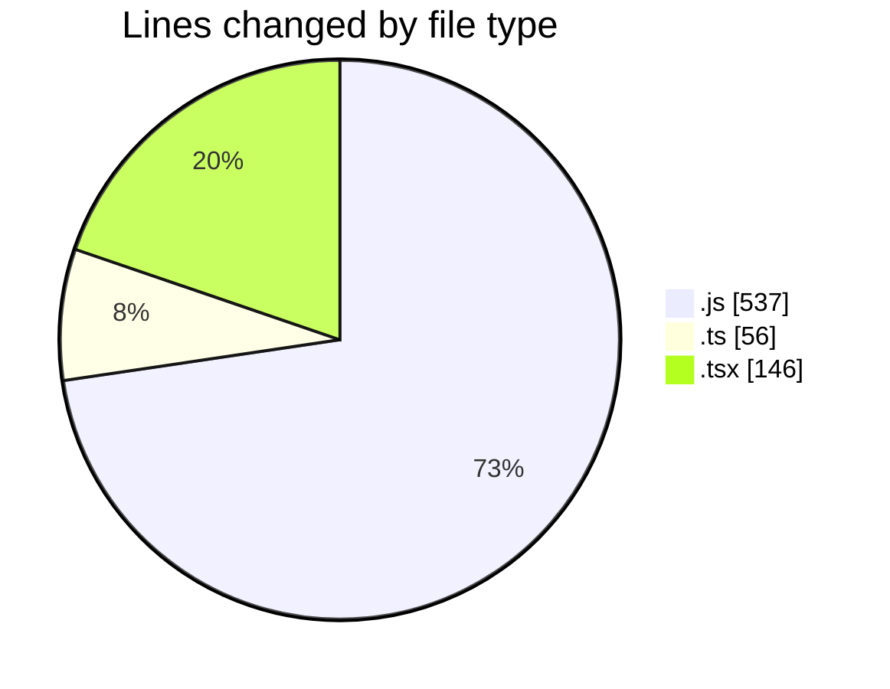

# cda - Activity Summary 

## Overall Statistics

| Stat                   | Value                                                             |
| ---------------------- | ----------------------------------------------------------------- |
| **Lines Added** (➕)   | 735                                          |
| **Lines Removed** (➖) | 4                                        |
| **Net Change** (↕)    | 731                |
| **Active Time** (⌚)   | 14 minutes |

## Modified Files
- **queries.js** (+537, -0)
- **index.ts** (+3, -0)
- **GenerateSkillTemplateTab.tsx** (+100, -0)
- **parseSkillWorkbook.test.ts** (+50, -3)
- **SkillImportPanel.test.tsx** (+45, -1)

## Visualizations

### By File Type (Lines Changed)

### By Hour (Estimated Activity Count)

> **Last Updated:** 06/10/2026, 10:39:24