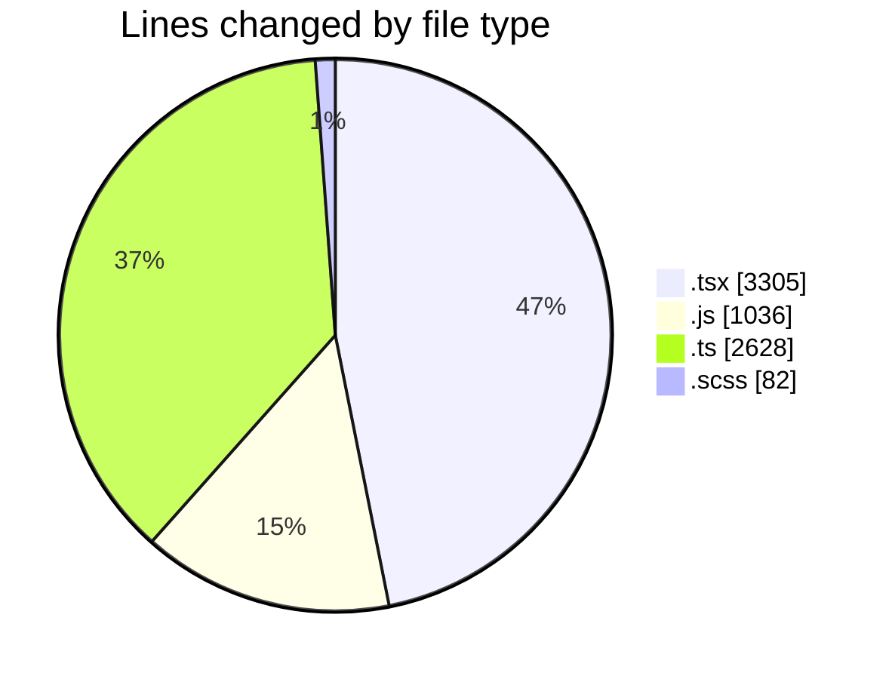
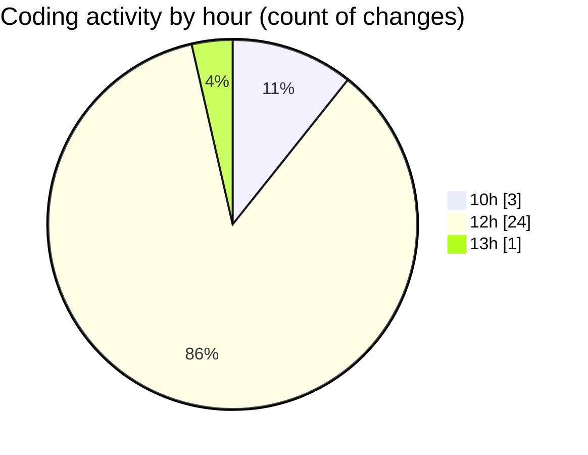

# cda - Activity Summary 

## Overall Statistics

| Stat                   | Value                                                             |
| ---------------------- | ----------------------------------------------------------------- |
| **Lines Added** (➕)   | 6964                                          |
| **Lines Removed** (➖) | 87                                        |
| **Net Change** (↕)    | 6877                |
| **Active Time** (⌚)   | 24 minutes |

## Modified Files
- **NewGroupPanel.tsx** (+411, -0)
- **NewGroup.tsx** (+675, -0)
- **NewGroupPanel.test.tsx** (+539, -0)
- **SkillImportPanel.tsx** (+87, -87)
- **skills.js** (+499, -0)
- **skills.ts** (+390, -0)
- **skill-queries.ts** (+776, -0)
- **SkillGroups.test.ts** (+933, -0)
- **transform-group-skill-progress.test.ts** (+152, -0)
- **queries.js** (+537, -0)
- **App.tsx** (+233, -0)
- **GroupDetails.tsx** (+244, -0)
- **GroupMembersList.tsx** (+76, -0)
- **SortableTable.tsx** (+109, -0)
- **GroupDetails.scss** (+59, -0)
- **GroupSkillProgress.scss** (+8, -0)
- **GroupSkillProgress.tsx** (+133, -0)
- **GroupMembersView.tsx** (+14, -0)
- **index.ts** (+2, -0)
- **index.ts** (+2, -0)
- **GroupDetails.test.tsx** (+277, -0)
- **GroupSkillProgress.test.tsx** (+82, -0)
- **SortableTable.test.tsx** (+41, -0)
- **SortableTable.scss** (+15, -0)
- **SkillExplore.tsx** (+297, -0)
- **skill-export.test.ts** (+370, -0)
- **SkillTemplateService.test.ts** (+3, -0)

## Visualizations

### By File Type (Lines Changed)

### By Hour (Estimated Activity Count)

> **Last Updated:** 07/10/2026, 13:11:06